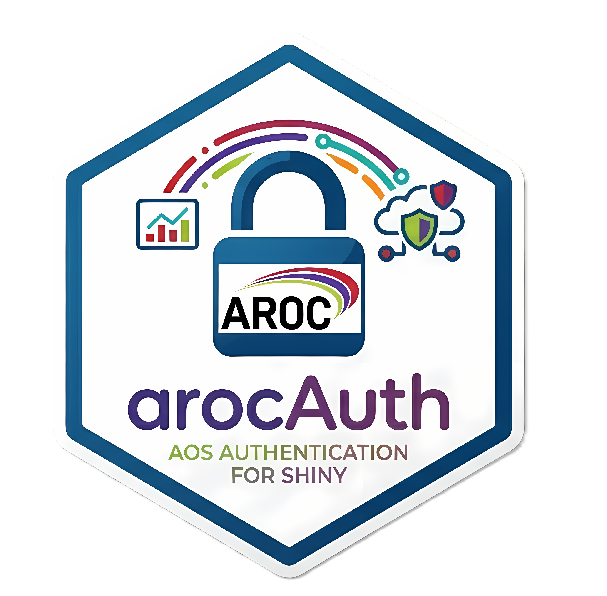

# arocAuth 

<!-- badges: start -->


<!-- badges: end -->

Token-based authentication module for AROC Shiny applications. Validates single-use tokens, resolves hierarchical access (Organisation > Area > Facility), and provides a drop-in Shiny module for securing any AROC dashboard.

## Installation

Install from the AROC GitLab repository:

```r
# Using remotes
remotes::install_gitlab(
  "aroc/r-shiny-applications/aroc-auth",
  host = "https://gitlab.uow.edu.au"
)

# Or using renv (recommended for project-level dependency management)
renv::install("git@gitlab.uow.edu.au:aroc/r-shiny-applications/aroc-auth.git")
```

> **Note:** You must have access to the [AROC GitLab](https://gitlab.uow.edu.au/aroc/r-shiny-applications/aroc-auth) repository. Configure a GitLab personal access token or SSH key if prompted for authentication.

## Quick Start

```r
library(shiny)
library(arocAuth)

ui <- fluidPage(
  arocAuth::mod_authentication_ui("auth")
  # ... your app UI
)

server <- function(input, output, session) {
  user_settings <- reactiveValues(
    username   = NULL,
    access_ids = NULL
  )

  arocAuth::mod_authentication_server(
    id                 = "auth",
    user_settings      = user_settings,
    parent_session     = session,
    con_ArocOnline     = con_ArocOnline,
    con_OnlineReporting = con_OnlineReporting,
    app_config = list(
      usertype_flag_col  = "flag_inp_dash",
      orglist_flag_col   = "Flag_Inpatient",
      admin_token        = Sys.getenv("AROC_ADMIN_TOKEN"),
      admin_hospital_ids = c(1L, 2L, 3L)
    )
  )
}

shinyApp(ui, server)
```

## How It Works

### Authentication Flow

```
URL: ?token=<TOKEN>
        │
        ▼
  Parse query string
        │
        ▼
  Admin token? ─── YES ──> Grant full access
        │                   (admin_hospital_ids)
        NO
        │
        ▼
  Fetch DataVisToken table
  from ArocOnline DB
        │
        ▼
  Match token to record
        │
        ▼
  Fetch allowed UserTypeIds
  from vw_arocAuth_Application_UserTypes
        │
        ▼
  Parse JsonData & resolve
  hierarchical access to HospitalIds
        │
        ▼
  Populate user_settings
  (username, access_ids)
        │
        ▼
  Delete token (single-use)
```

### Hierarchical Access Resolution

Users may hold access at any level in the AROC organisational hierarchy. `resolve_hospital_ids()` normalises all access down to concrete `HospitalId` values using the `vw_orglist` view:

| Access Level   | Resolution                                        |
|----------------|---------------------------------------------------|
| `Facility`     | Passed through directly as HospitalIds             |
| `Area`         | Looked up via `vw_orglist` → child HospitalIds     |
| `Organisation` | Looked up via `vw_orglist` → child HospitalIds     |
| `Payer`        | Returned separately as `payer_ids`                 |
| `Ward`         | Not yet supported                                  |

A single token can contain multiple access entries across different levels. All matching entries are combined and deduplicated.

### Dynamic UserType Filtering

Rather than hardcoding allowed `UserTypeId` values, arocAuth queries `[web].[vw_arocAuth_Application_UserTypes]` at startup. Each AROC application has its own flag column (e.g. `flag_inp_dash`, `flag_inr_dash`), so the same user types can be enabled or disabled per-app without code changes.

### Dataset Flag Filtering

The `orglist_flag_col` parameter controls which facilities are included during hierarchy resolution. For example, `"Flag_Inpatient"` limits results to inpatient facilities while `"Flag_Inreach"` limits to inreach facilities. This ensures users only see facilities relevant to the application.

## Exported Functions

### `mod_authentication_ui(id)` / `mod_authentication_server(id, ...)`

Shiny module pair. The UI is an empty placeholder — authentication operates entirely server-side via URL query parameters.

**Server parameters:**

| Parameter            | Description                                                                 |
|----------------------|-----------------------------------------------------------------------------|
| `user_settings`      | `reactiveValues` object — receives `username` and `access_ids`              |
| `parent_session`     | The parent Shiny session (needed for query string parsing)                  |
| `con_ArocOnline`     | Pool connection to AOS_ProdSG_ArocOnline (DataVisToken table)              |
| `con_OnlineReporting`| Pool connection to AOS_Prod_OnlineReporting (vw_orglist, token deletion)    |
| `app_config`         | Named list — see [Configuration](#configuration)                           |

### `resolve_hospital_ids(json_data, allowed_user_types, con_reporting, flag_col)`

Parses a DataVisToken JSON payload and resolves access entries to HospitalIds. Returns a list with `hospital_ids`, `payer_ids`, and `error` fields.

### `fetch_allowed_user_types(usertype_flag_col, con_aroc_online)`

Queries `vw_arocAuth_Application_UserTypes` and returns an integer vector of `UserTypeId` values where the given flag column equals 1. Stops with an error if none are found.

### `delete_token(token_raw, con_reporting)`

Calls `[dbo].[_sp_DeleteShinyToken]` to remove a used token from the database.

## Configuration

The `app_config` list passed to `mod_authentication_server()`:

| Key                  | Type             | Description                                                        |
|----------------------|------------------|--------------------------------------------------------------------|
| `usertype_flag_col`  | Character        | Flag column in `vw_arocAuth_Application_UserTypes` for this app    |
| `orglist_flag_col`   | Character        | Flag column in `vw_orglist` to filter facilities (default: `"Flag_Inpatient"`) |
| `admin_token`        | Character / NULL | Admin bypass token value (recommended: `Sys.getenv(...)`)          |
| `admin_hospital_ids` | Integer vector   | HospitalIds granted when admin token is used                       |

## Database Dependencies

| Resource                                | Database              | Purpose                           |
|-----------------------------------------|-----------------------|-----------------------------------|
| `DataVisToken`                          | ArocOnline            | Token records (UserName, JsonData)|
| `[web].[vw_arocAuth_Application_UserTypes]` | ArocOnline       | Allowed UserTypeIds per app       |
| `vw_orglist`                            | OnlineReporting       | Org → Area → Facility hierarchy   |
| `[dbo].[_sp_DeleteShinyToken]`          | OnlineReporting       | Single-use token cleanup          |

## User Settings

After successful authentication, `user_settings` contains:

| Field        | Type             | Description                                |
|--------------|------------------|--------------------------------------------|
| `username`   | Character        | Username from token record or `"AROC_ADMIN"` |
| `access_ids` | Integer vector   | Resolved HospitalIds the user can access   |
| `payer_ids`  | Integer vector   | Payer IDs (if payer-level access exists)    |

The consuming application is responsible for using `access_ids` to filter data (e.g. restricting a facility dropdown to only permitted facilities).

## Token Lifecycle

1. An external system inserts a token into `DataVisToken` with the user's access JSON.
2. The user is redirected to the app with `?token=<TOKEN>`.
3. arocAuth validates the token and resolves access.
4. The token is deleted via `_sp_DeleteShinyToken` — tokens are **single-use**.

Admin tokens are a keyword match and are not deleted.

## License

Proprietary &copy; 2026 AROC, Australasian Health Outcomes Consortium (AHOC), University of Wollongong. All rights reserved. See [LICENSE](LICENSE) for details.
